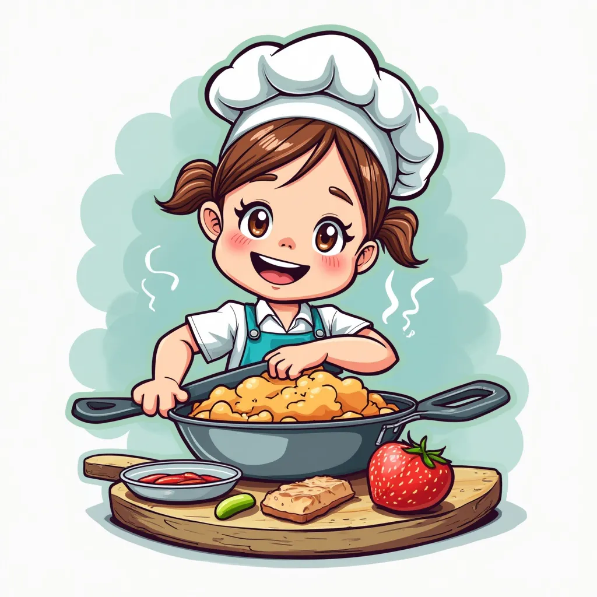
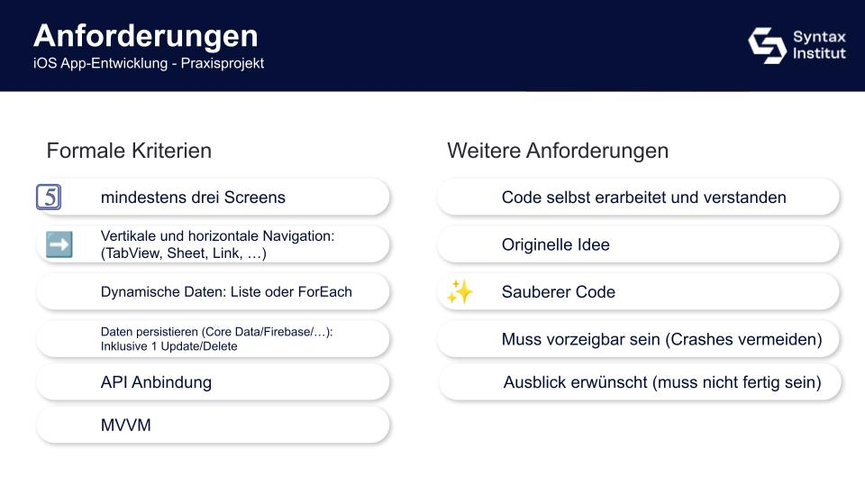

# KidsKitchen
Kindern spielerisch leicht, alles zum Thema Nahrung beibringen

_Die App KidsKitchen ist ein Herzensprojekt für meine Nichte, die gerade kochen lernen möchte._

## **Wer? Wie? Was?**
Hier sollen die wichtigsten Fragen zum Projekt geklärt werden.

### Wer?
**Für wen ist das interssant:**
* Hiermit möchte ich potenzielle Arbeit- & Auftraggeber auf mich und meine Art und Weise zu Programmieren aufmerksam machen.
Des weiteren darf dieser Code gerne als inspiration genutzt werden, da ich nach Möglichkeit, aktuelle Technologien, grade im Bereich von Animationen nutzen möchte.
Auch möchte ich grade Kinder & Jugendlich dazu animieren, sich bewusster mit dem Thema Nahrung auseinander zu setzen ohne dabei voreingenommen, gegenüber einer dieser Ernährungsformen zu sein.

**Zu meiner Person**
Ich bin Joscha (38) aus Berlin und befinde mich zur Zeit (September '24) in einer Weiterbildung zum App Entwickler am [Syntax Institut](https://www.syntax-institut.de) in Berlin. Ich komme aus der Gastronomie, in der ich knapp 20 Jahre tätig gewesen bin. In den letzten 8-10 Monaten meiner Gastronomie Karriere, sind mir immer mehr Dinge aufgefallen, die ich gerne automatisiert hätte und so bin ich beim Syntax Institut gelandet.
Diesen Schritt bereue ich zu keinem Zeitpunkt. Im Programmieren von Apps habe ich meine Passion gefunden und auch das möchte ich mit dieser App zum Ausdruck bringen.

### Was?
Dies ist das Abschlussprojekt im 4. und letzten Modul meiner Weiterbildung zum App Entwickler am [Syntax Institut](https://www.syntax-institut.de) in Berlin, dem **iOS Modul**. 
Es handelt sich hierbei um eine **App für Kinder**. Mit dieser App dürfen Kinder spielerisch lernen, wie man kocht.
Auch die Eltern dürfen dabei nicht zu kurz kommen und so können sie sich den richtigen Umgang mit Kindern und essen, zusammen mit ihren Kindern aneignen.

### Wie?
In der ersten Phase werde ich mich den Anforderungen entsprechend mit folgendem Auseinandersetzen:
- Als DesignPattern verwende ich **MVVM**.
- **SwiftData** für das Model
- **NavigationStack & -Link** für die Navigation zum Home Screen
- **ForEach** für die MealList
- **Sheet & List** für das UserProfil

## **Anforderungen**

## **Umsetzung || Phase 1 || MainApp Funktionen**

**Die App soll Funktionieren**

Damit ich das Wasserfall Prinzip beim Programmieren vermeide, unterteile ich den Bau der App in verschiedene Phasen. In **Phase 1** liegt mein Hauptfokus darauf, die App zum laufen zu bringen und die Hauptanforderungen zu erfüllen. Dies beinhaltet unter anderem:
* die Wahl des richtigen Designs bei den Screens:
    - SignIn / SignUp
    - Home / RandomMealList
    - UserProfile
    - MealDetail
* das Anzeige aller Daten, im richtigen Format sicherzustellen:
    - den korrekten Umgang mit der Api sicherstellen
    - mindestens ein Repository bauen
    - ein MealViewModel & ein UserViewModel bauen

### **1 | SignIn / SignUp** 
- Hier werden beim SignUp die ersten relevanten Daten von einer **_API_** geladen.
- Der Screen wird in einen **_NavigationStack_** gebettet werden. Infolge dessen kann ich mit einem **_NavigationLink_** Vertical Navigieren
- Für die Sicherheit der Daten bei diesem Prozess, gibt es die Überlegung, den User zu fragen, ob er auch ein Android Gerät besitzt und wenn ja, ob die Daten zwischen den Geräten Synchronisiert werden sollen. Sollte auch dies zutreffen, kann der User sich über Firebase anmelden.
  _?? ggf erst in einer späteren Phase mit einbauen ??_
- Ansonsonsten wird für die Anmeldung auf Apple Technologie gesetzt und der User kann sich über seine Apple ID anmelden um so auf die CloudFunktion von Apple zuzugreifen

### **2 | Home / MealList inklusive VM**
- Auf dem Home Screen werden Anfangs nur 8 Random Gerichte aus 2 Kategorien zu sehen sein.
  _möglicherweise sind diese Kategorien wählbar oder dies geschieht auch in einer späteren Phase_
- Die Daten für diese Gerichte werden aus einem **_ViewModel_** geladen und dann in einer ForEach schleife angezeigt
  _bei der Wahl ob es eine Liste oder ein ScrollView wird bin ich mir noch unschlüssig. Dies werde ich während des Programmeriens der Screens entscheiden, da ich auf diese Weise am besten meine Designs beurteilen kann. Auch die Frage der Machbarkeit erledigt sich dabei._
- Jedes dieser Gerichte wird _klickbar_ sein, woraufhin man zum **_MealDetail_** gelangt. Hierfür werde ich einen Überblendungseffekt effekt nutzen, den ich aus de Buch [SwiftUI Animations Mastery*](https://www.bigmountainstudio.com/animations/423bv) von Mark Moeykens habe.
- Des weiteren wird es ein User Profile geben, welches über einen Sheet nach oben fährt. Der Button dafür, wird in die toolbar des NavigationStack _vom SignIn_ Bereich kommen.

***dies ist ein Affliate Link. Es handelt sich um eine bezahlte Partnerschaft.**
_unabhängig davon, kann ich das Buch sehr empfehlen_

### **3 | UserProfile inklusive VM**
- Wird anfangs sehr kurz gehalten werden.
- Möglichkeit, der Wahl von Ernährungsart
- Auschschluss Tabelle _mit Hinweis auf Lebensmittelunverträglichkeitstests_

### **4 | MealDetail**
- Ein Bild des Gerichtes wird hier angezeigt werden
- Die dazu gehörigen Zutaten inklusive der jeweiligen Maßeinheit
- Auch die Arbeitsschritte sind zu sehen
- _hier bietet sich die Möglichkeit, mit Zeichnungen der jeweiligen Arbeitsschritte zu arbeiten_
- _alternativ findet man sicherlich viele Videos auf YouTube_ 🤷

### Repository
- hier stellt sich zur Zeit noch die Frage, ob ich selbst eine API(?) oder möglicherweise auch einen Server bauen muss, da noch nicht sichergestellt ist, woher ich meine Daten bekomme.
    - _stand 7. Sept.: habe ich 3 Websites, die sehr schönen Inhalt bieten angeschrieben oder angerufen, sollten sich hier neuigkeiten ereignen, werde ich dies hier selbstverständlich Updaten_

### Model
Um auch mit der Zeit zu gehen, werde ich für meinen PersistentStore SwiftData verwenden. Da ich erst in einer späteren Version die Möglichkeit einbinden werde, zwischen Android & Apple Geräten zu Switchen. Bleibt es auch vorerst dabei.

_In den Beiträgen 👉 [Meet SwiftData](https://developer.apple.com/wwdc23/10187) & 👉 [Migrate to SwiftData](https://developer.apple.com/wwdc23/10189) kannst du mehr darüber erfahren. Beide Beiträge sind von der WWDC23._

## **Umsetzung || Phase 2 || Erweiterungen**

Ab hier lässt es sich leicht Feature Basiert zu arbeiten. Da Ich bis jetzt auch noch keinen **_TabView_** benutze um den Home Screen anzusteuern, kann ich so die App auf einfache Weise erweitern. Selbstverständlich ist das nicht alles, auch einige Screens werde ich um gewisse Funktionen erweitern.

### SignIn || SignUp erweitern
- Da es sich um eine Kinder App handelt, möchte ich gleich schon beim einloggen auf relevante Dinge wie Anonymität & Sicherheit im Internet eingehen. _grade im Bezug auch zu den folgenden Informationen_
- Des weiteren werden beim SignUp auch User Informationen, wie bevorzugte Ernährungsweise etc abgefragt, sodass gleich ausschliesslich relevante Gerichte von der **_API_** geladen werden.

### OnBoarding einbauen & UserProfil erweitern
- Hier sollen gleich die ersten wirklich wichtigen Punkte beim Kochen erklärt werden:
    - Hygiene
    - Sicherheit
    - Sauberes Arbeiten
    - Mülltrennung
- das UserProfilVM wird um den Boolean isOnBoarded erweitert
um die Erfolgschancen zu erhöhen, dass das OnBoarding auch wirklich verfolgt wird, werde ich hier mit Apples neuer TextAnimation arbeiten, sodass der Text ca in Lesegeschwindigkeit angezeigt wird
_gif Datei mit einem Beispiel dafür folgt_

### Home & UserProfil erweitern und Quiz mit VM einbauen
- Um sicherzustellen, das der OnBoarding Teil auch _wirklich_ verstanden wurde, werden im Home Screen zu beginn nur 3 Gerichte angezeigt.
- Weitere Gerichte kann man nun dem Beantworten von Fragen zu den Themen aus dem OnBoarding _**Freischalten**_
- die Punkte aus dem Quiz geben an, welche Inhalte für den User freigeschaltet werden und welche nicht.
- das UserProfilVM wird um den Integer userPoints erweitert
- Quiz hat verschiedene Punkte stände und Kategorien

### Nährwerte mit einbinden
hier gibt es einiges an Funktionsumfang zum einbinden. Das sind unter anderem:
- Repository bauen, um Daten zu Nährwerten etc zu erhalten
- UserProfileVM um Bereiche zum Tracken der eigenen Nährwerte etc…
- Auflisten der Werte
- Kritische Bereich markieren
- _hier bestet auch die Möglichkeit, zum anbinden der FitnessDaten ggf in Phase 3_

## **Umsetzung || Phase 3 || _mögliche_ BONUS Features**

### FitnessDaten mit an die App anknüpfen

### Wochenpläne für verschiedene Ernährungsweisen zum Ausprobieren

### Tracking von gekauften Lebensmitteln durch scannen des Barcodes

### Quiz & Wissen erweitern
mögliche Bereiche sind hier:
- Gesunde Lebensmittel, die die Heilung fördern(?) … etc …
- Geschmacksharmonien

### ab 16 Edition
Bier & Wein erklärt

### ab 18 Edition
Schnapps & Cocktails erklärt
Möglichkeit zum anbinden an andere Apps 😉
